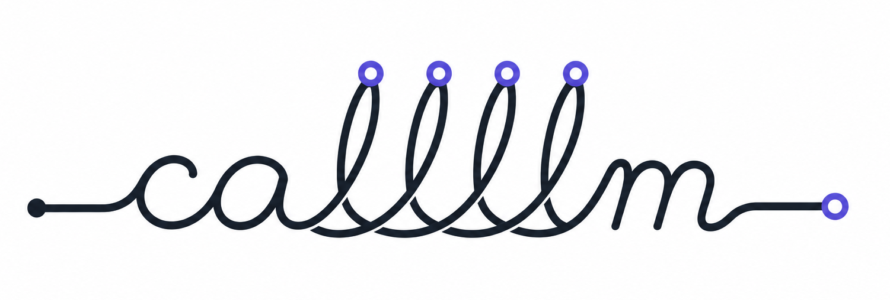

<p align="center">
  
</p>

<h1 align="center">callllm</h1>

<p align="center">
  <a href="https://www.npmjs.com/package/callllm"></a>
  <a href="https://github.com/a2arium/callllm/actions/workflows/ci.yml"></a>
  <a href="https://www.typescriptlang.org/"></a>
  <a href="https://nodejs.org/">=20" /></a>
  <a href="LICENSE"></a>
</p>

A TypeScript framework for production LLM calls.

`callllm` lets you describe what a request needs and runs it through a compatible model/provider with normalized output, usage, cost, and telemetry-ready metadata.

Use it for text, structured JSON, tools, streaming, images, audio, embeddings, and model selection based on capability, cost, latency, or context size.

Use an exact model when model identity is part of your application contract. Use presets like `fast`, `cheap`, `balanced`, and `premium` when you want `callllm` to choose based on the actual request requirements.

## Quick Example

```ts
import { LLMCaller } from 'callllm';

const caller = new LLMCaller('openai', 'gpt-5-mini');

const result = await caller.call('Summarize this in one sentence.', {
  data: 'The CSV export works for small reports but times out for the monthly billing report.'
});

console.log(result[0].content);
```

For production workflows, use provider scopes and model presets:

```ts
const caller = new LLMCaller(['openai', 'gemini'], 'cheap');

const result = await caller.call('Summarize this support ticket in one sentence.', {
  data: {
    subject: 'Export failed',
    body: 'The CSV export works for small reports but times out for the monthly billing report.'
  }
});

console.log(result[0].content);
console.log(result[0].metadata?.provider);
console.log(result[0].metadata?.model);
console.log(result[0].metadata?.usage?.costs.total);
```

## How It Works

`callllm` combines three things:

```ts
new LLMCaller(providerScope, modelSelection, systemMessage?, options?)
```

1. **Provider scope**: where the request is allowed to run, for example `'openai'` or `['openai', 'gemini']`.
2. **Model selection**: an exact model, a preset such as `'fast'`, or a custom policy.
3. **Request requirements**: what the current call needs: tools, streaming, image output, audio, embeddings, reasoning, context size, cost constraints, or native provider features.

```text
request
  + provider scope
  + model selection
  + required capabilities
        |
        v
model resolver
        |
        v
provider adapter
        |
        v
normalized response + usage + telemetry metadata
```

If you pass an exact model, `callllm` uses that model or fails. If you pass a preset or policy, `callllm` filters models by the request requirements and selects a compatible option.

`caller.call()` returns an array of choices. Most calls use `result[0]`.

Each choice can include:

- `content`: normalized text output
- `contentObject`: parsed structured output when JSON/schema mode is used
- `metadata.provider`: selected provider
- `metadata.model`: selected model
- `metadata.usage`: tokens, media usage, and estimated cost

Use `data` to attach structured or long-form context to a request. Depending on the request and settings, `callllm` serializes it into the provider request and can split large values into model-sized chunks.

## Why callllm?

Provider SDKs are best when your app always calls one known model in one known way.

`callllm` is designed for applications where requests vary at runtime:

- some need fast text
- some need strict JSON
- some need tools or streaming
- some need image, audio, video, or embeddings
- some need cost, latency, or context constraints
- all need consistent usage, cost, and telemetry metadata

With `callllm`, you can keep exact model control where it matters and use presets or policies where runtime selection is more useful.

- **Capability-aware model selection**: `fast` means a fast text model for chat, a fast image model for image generation, a fast embedding model for embeddings, and a fast audio-capable model for transcription.
- **Exact model control when needed**: `{ model: 'gpt-5-mini' }` is strict. It will not silently switch models.
- **Typed structured output**: use Zod or JSON Schema, get parsed `contentObject`, and choose native JSON mode or prompt fallback.
- **Tools that feel like application code**: register local functions, load function folders, or expose MCP server tools.
- **Cost visibility**: every response can include tokens, media durations, generated media units, and estimated cost.
- **Telemetry-ready operations**: track selected provider/model, model-resolution metadata, prompts, choices, tools, usage, costs, and OpenTelemetry or Opik traces.
- **Large input handling**: split large strings, objects, and markdown into model-sized chunks, with optional parallel processing.

## Installation

```bash
npm install callllm
```

```bash
yarn add callllm
pnpm add callllm
```

Requirements:

- Node.js `>=20`
- TypeScript is supported through generated declarations
- At least one provider API key, depending on the provider you use

```env
OPENAI_API_KEY=...
GEMINI_API_KEY=...
OPENROUTER_API_KEY=...
CEREBRAS_API_KEY=...
VENICE_API_KEY=...
```

## Run Locally

Create `index.ts`:

```ts
import { LLMCaller } from 'callllm';

const caller = new LLMCaller('openai', 'gpt-5-mini', 'You write concise product copy.');

const result = await caller.call('Write a welcome message for a developer analytics dashboard.');

console.log(result[0].content);
console.log('Usage:', result[0].metadata?.usage);
```

Run it with your preferred TypeScript runner:

```bash
npx tsx index.ts
```

Expected shape:

```text
Welcome to your developer analytics dashboard...
Usage: { tokens: ..., costs: ... }
```

The repository examples can also be run directly:

```bash
yarn example:simple
yarn example:json
yarn example:tool
yarn example:modelSelection
```

## Core Workflows

### Text

```ts
const caller = new LLMCaller('gemini', 'fast');
const response = await caller.call('Explain TypeScript generics in two paragraphs.');

console.log(response[0].content);
```

### Structured JSON

```ts
import { z } from 'zod';
import { LLMCaller } from 'callllm';

const TicketSchema = z.object({
  severity: z.enum(['low', 'medium', 'high']),
  summary: z.string(),
  nextActions: z.array(z.string())
});

type Ticket = z.infer<typeof TicketSchema>;

const caller = new LLMCaller(['openai', 'gemini'], 'balanced');
const result = await caller.call<Ticket>('Classify this support ticket.', {
  data: 'Customer cannot export billing reports. Export works for small reports only.',
  jsonSchema: { name: 'TicketClassification', schema: TicketSchema },
  responseFormat: 'json'
});

console.log(result[0].contentObject);
```

Structured JSON works through native provider support when available and prompt/schema fallback otherwise. Use `jsonMode: 'native-only'` only when native structured output is a hard requirement.

### Tool Calling

For application code, the easiest and most testable pattern is usually a function folder: each tool lives in its own TypeScript file, can be unit-tested directly, and can be loaded by name.

```ts
const caller = new LLMCaller('openai', 'gpt-5-mini', 'You are a support agent.', {
  toolsDir: './tools'
});

const response = await caller.call('Why is order A100 delayed?', {
  tools: ['getOrder']
});

console.log(response[0].content);
```

Use inline `ToolDefinition` objects when the tool is small or created dynamically:

```ts
import { LLMCaller, type ToolDefinition } from 'callllm';

const getOrder: ToolDefinition = {
  name: 'get_order',
  description: 'Look up an order by id.',
  parameters: {
    type: 'object',
    properties: {
      orderId: { type: 'string', description: 'The order id.' }
    },
    required: ['orderId']
  },
  callFunction: async ({ orderId }) => ({
    orderId,
    status: 'delayed',
    eta: '2026-05-12'
  })
};

const caller = new LLMCaller('openai', 'gpt-5-mini', 'You are a support agent.', {
  tools: [getOrder]
});

const response = await caller.call('Why is order A100 delayed?');

console.log(response[0].content);
```

### Streaming

```ts
const caller = new LLMCaller('openai', 'gpt-5-mini');

for await (const chunk of caller.stream('Draft a short incident update.')) {
  if (!chunk.isComplete) process.stdout.write(chunk.content);
  if (chunk.isComplete) console.log('\nCost:', chunk.metadata?.usage?.costs.total);
}
```

## Additional Capabilities

The same request model also applies to:

- **Images**: image input, generation, editing, masked editing, and saved image output.
- **Audio**: speech-to-text, translation, and text-to-speech with local `ffmpeg` transcoding when provider input/output needs conversion.
- **Video**: asynchronous video jobs with status polling, download helpers, usage seconds, and estimated video cost.
- **Embeddings**: exact embedding models for retrieval systems or dynamic embedding-capable selection for one-off jobs.
- **Large inputs**: split large strings, objects, and markdown into model-sized chunks.
- **MCP and function folders**: expose external tool servers or load local tool files by name.

See the guides below for full examples.

## Model Selection

Use exact models when the model identity is part of your application contract:

```ts
new LLMCaller('openai', 'gpt-5-mini');
new LLMCaller('openai', { model: 'gpt-5-mini' });
```

Use presets when you want the framework to choose a model that can satisfy the current request:

```ts
new LLMCaller(['openai', 'gemini'], 'fast');
new LLMCaller(['openai', 'gemini'], 'cheap');
new LLMCaller(['openai', 'gemini'], 'balanced');
new LLMCaller(['openai', 'gemini'], 'premium');
```

Use policies when you need hard constraints or custom tradeoffs:

```ts
const caller = new LLMCaller(['openai', 'gemini'], {
  preset: 'balanced',
  prefer: {
    cost: 0.3,
    latency: 0.3,
    quality: 0.4
  },
  constraints: {
    maxOutputPricePerMillion: 5,
    minContextTokens: 32000
  },
  resolution: { explain: true }
});
```

Every response includes stable model metadata:

```ts
console.log(response[0].metadata?.provider);
console.log(response[0].metadata?.model);
console.log(response[0].metadata?.selectionMode); // exact | preset | policy
```

Read the full guide: [Model selection](docs/guides/model-selection.md).

## Usage and Telemetry

Every operation can report normalized usage:

```ts
const caller = new LLMCaller('openai', 'gpt-5-mini', 'You are concise.', {
  callerId: 'support-thread-42',
  usageCallback: ({ callerId, usage, timestamp }) => {
    console.log(callerId, usage.costs.total, new Date(timestamp).toISOString());
  }
});

const response = await caller.call('Summarize this ticket.', {
  data: 'The customer cannot export the billing report.'
});

console.log(response[0].metadata?.usage);
```

The built-in telemetry collector can emit normalized spans/events to OpenTelemetry and Opik when enabled by environment variables. See [Telemetry and usage](docs/guides/telemetry-and-usage.md).

## Contracts and Limits

`callllm` is designed to make model routing explicit and inspectable:

- Exact model selection never silently switches models.
- Preset and policy selection only choose models inside the constructor provider scope.
- Preset and policy selection filter by detected hard requirements before scoring.
- Responses include normalized selected provider/model metadata when available.
- Usage and cost are reported when supported by provider usage metadata or model registry estimates.

It does not make LLM output deterministic, guarantee identical behavior across providers, or hide provider-specific capability differences. If provider-specific SDK features matter more than normalized behavior, call the provider SDK directly for that path.

You may not need `callllm` if your app calls one fixed model, does not need structured output or tools, and does not need normalized usage, cost, retries, or telemetry.

## How callllm Fits

`callllm` is not a full agent framework, hosted AI gateway, or UI SDK. It is a TypeScript runtime for application-level LLM calls where model choice, request capabilities, usage metadata, and production behavior need to stay explicit in code.

| Tool type | Best when you need | How `callllm` is different |
| --- | --- | --- |
| Provider SDKs | Direct access to one provider's full API | `callllm` normalizes calls, output, usage, cost, and model selection across providers. |
| AI UI SDKs | Chat UI, streaming UI, frontend integration | `callllm` focuses on backend/application LLM execution and runtime model selection. |
| Agent frameworks | Long-running agents, workflow graphs, memory, orchestration | `callllm` focuses on individual calls and tool-enabled workflows without requiring an agent architecture. |
| AI gateways | Centralized proxy, org-wide keys, caching, rate limits, governance | `callllm` runs inside your Node.js application and keeps request logic in code. |
| Raw model routers | Provider routing and fallback | `callllm` combines routing with typed structured output, tools, media, usage/cost metadata, and request capability detection. |

## Documentation

Start here:

- [Getting started](docs/getting-started.md)
- [Core concepts](docs/concepts.md)
- [Examples catalog](docs/examples.md)
- [API reference](docs/reference/api.md)
- [Errors and troubleshooting](docs/guides/errors-and-troubleshooting.md)

Guides:

- [Model selection](docs/guides/model-selection.md)
- [Structured output](docs/guides/structured-output.md)
- [Tool calling and MCP](docs/guides/tools-and-mcp.md)
- [Streaming, history, and large inputs](docs/guides/streaming-history-large-inputs.md)
- [Media: images, video, and audio](docs/guides/media.md)
- [Embeddings](docs/guides/embeddings.md)
- [Telemetry and usage](docs/guides/telemetry-and-usage.md)
- [Settings, retries, and overrides](docs/guides/retries-and-settings.md)

More guides:

- [Function folders](docs/guides/function-folders.md)
- [Retrieval with embeddings](docs/guides/retrieval-with-embeddings.md)
- [Message composition](docs/guides/message-composition.md)
- [Reasoning and verbosity](docs/guides/reasoning-and-verbosity.md)

Specialized references:

- [Configuration](docs/reference/configuration.md)
- [Models and capabilities](docs/reference/models-and-capabilities.md)
- [Response types](docs/reference/response-types.md)
- [History reference](docs/reference/history.md)
- [Image details](docs/reference/image-details.md)
- [MCP reference](docs/reference/mcp.md)
- [Model selection migration notes](docs/migration/model-selection.md)

## For Contributors

- [Contributing provider adapters](docs/contributing/providers.md)
- [Model selection implementation notes](docs/internal/model-selection-implementation.md)
- [Telemetry architecture notes](docs/internal/telemetry-architecture.md)

## Supported Providers

Provider registry keys and environment variables:

| Provider | Key | Environment variable |
| --- | --- | --- |
| OpenAI | `openai` | `OPENAI_API_KEY` |
| Gemini | `gemini` | `GEMINI_API_KEY` |
| OpenRouter | `openrouter` | `OPENROUTER_API_KEY` |
| Cerebras | `cerebras` | `CEREBRAS_API_KEY` |
| Venice | `venice` | `VENICE_API_KEY` |

Support is model-specific. Dynamic selection filters by the actual model capabilities before scoring. Structured JSON output is available through `callllm` for all chat-capable providers: native JSON mode is used when available, and prompt/schema fallback is used otherwise unless `jsonMode: 'native-only'` is requested.

## Production Notes

For production applications, configure:

- exact models or policies with cost/context constraints
- `historyMode: 'stateless'` for independent calls or `'dynamic'` for long conversations
- `maxRetries`, timeouts for MCP tools, and provider-level rate-limit handling
- structured output schemas for machine-consumed responses
- `usageCallback` and telemetry provider env vars for observability
- `LOG_LEVEL=warn` or `LOG_LEVEL=error` for quiet runtime logs
- redaction settings before sending prompts/responses to telemetry systems

LLM output is not deterministic. For workflows that require correctness, use schemas, validation, retries, tests with mocked provider responses, and explicit error handling.

## Logging

Set framework log level with:

```env
LOG_LEVEL=error
```

`LOG_LEVEL` controls logs emitted through the `callllm` logger. It does not suppress output that your application writes directly with `console.log`, `console.error`, or `process.stdout.write`. Telemetry SDKs may also have their own log settings. When Opik is enabled, set `OPIK_LOG_LEVEL=ERROR` if you need to quiet Opik SDK logs.

## Development

```bash
yarn install
yarn build
yarn test
yarn prepublishOnly
```

### Publishing

Publishing is automated by `.github/workflows/publish.yml`.

To release a new npm version:

1. Update `package.json` to a new version.
2. Push the change to `main`.
3. GitHub Actions builds, verifies, and publishes the package if that version does not already exist on npm.

The workflow expects a GitHub repository secret named `NPM_TOKEN` containing an npm automation token. It publishes with provenance enabled.

Useful examples:

```bash
yarn example:simple
yarn example:json
yarn example:tool
yarn example:imageGenerate
yarn example:speechSynthesis
yarn example:speechTranscription
```

## License

MIT
